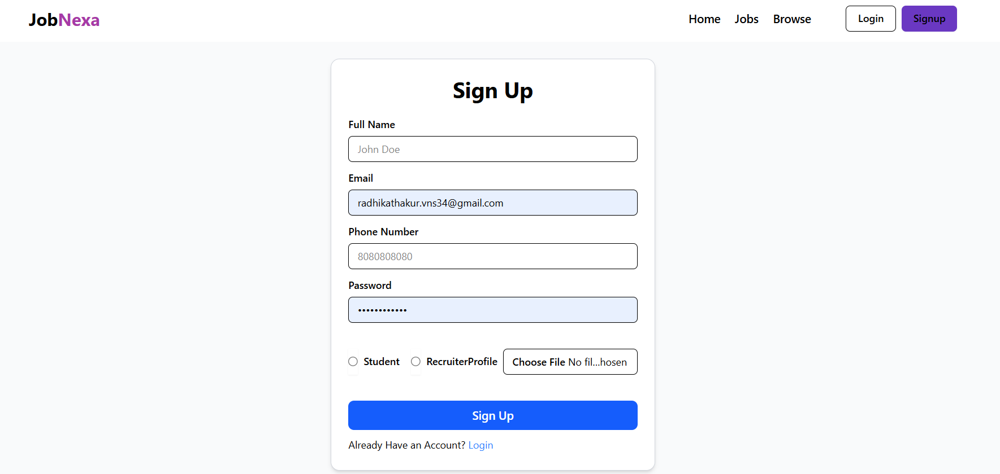
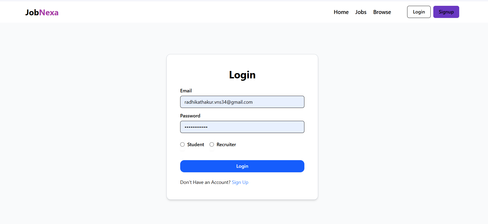
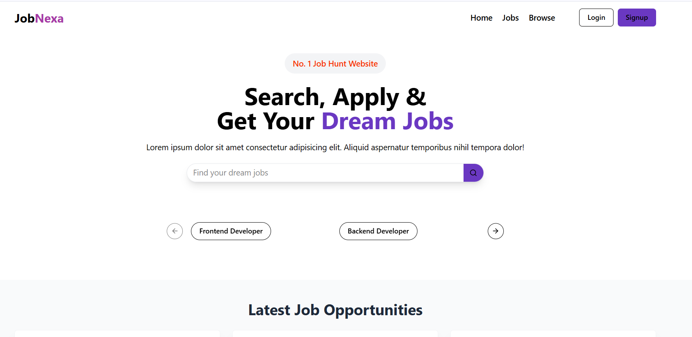
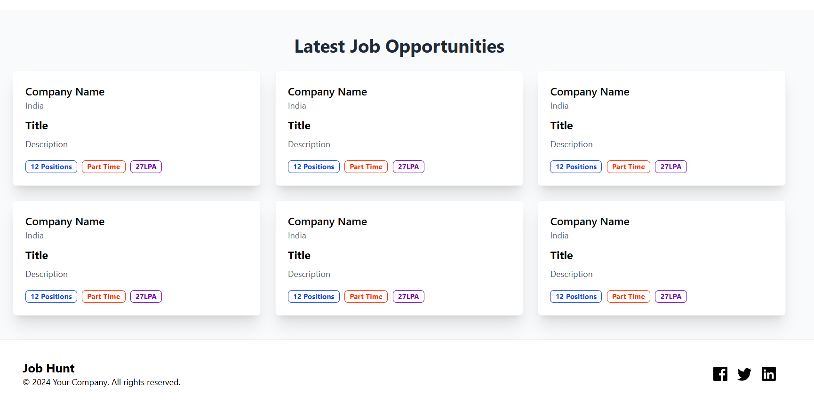
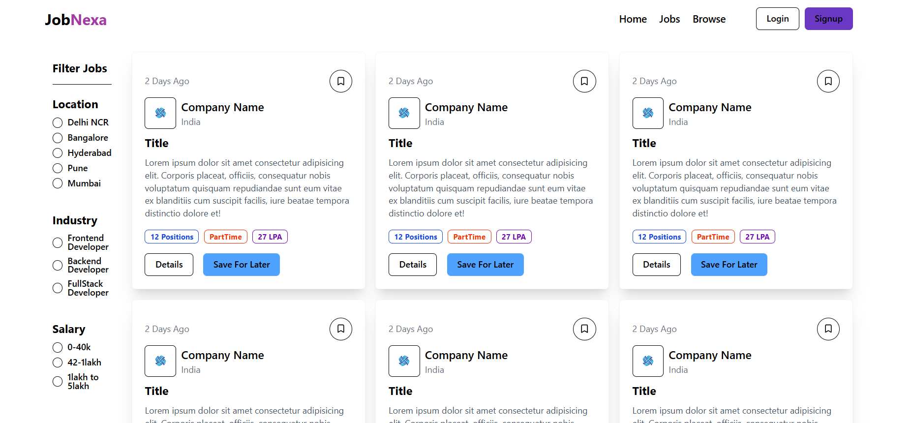

# Job Portal -JobNexa

A **JobNexa** web application designed to bridge the gap between talented **students** and potential employers. Students can easily search, find, and apply for jobs, while **recruiters** can post job listings, review applications, and hire top talent. Built using the **MERN Stack** (MongoDB, Express.js, React.js, Node.js) for a seamless experience, ShadCN UI and Tailwind CSS for a modern and responsive interface, and additional features such as real-time notifications and personalized job recommendations. The platform ensures an intuitive, efficient, and scalable solution for job seekers and recruiters alike.


##  Features

###  Students:
- Sign up & login securely as Student
- Search & apply for jobs
- Track applied job status
- Personalized dashboard with job recommendations

### Recruiters:
- Register & login as Recruiter 
- Post new job listings by filling essential job details
- View & manage job applications
- Track how many have applied for job

###  General:
- Secure authentication using JWT
- Real-time notifications for activity
- Advanced job filtering by location, salary, and role


## Tech Stack

### Frontend:
- **React.js** – Dynamic user interface
- **Redux.js** – State management
- **ShadCN UI** – Accessible and elegant UI components
- **Tailwind CSS** – Utility-first CSS framework
- **JavaScript (ES6+)**

### Backend:
- **Node.js** – JS runtime environment
- **Express.js** – Backend web framework

### Database & Auth:
- **MongoDB** – NoSQL database
- **Mongoose** – Object data modeling (ODM)
- **JWT (JSON Web Token)** – Authentication
- **Bcrypt.js** – Password encryption
- **NextAuth.js** - Authentication library for Next.js.

### Utilities:
- **Axios** – API requests
- **Dotenv** – Environment configuration
- **Cors** – Cross-origin handling
- **Sonner** -Toast notifications


## Installation & Setup

### 1. Clone the Repository

```bash
git clone https://github.com/Radhika74/JobPortal.git
cd JobPortal
```

---

### 2. Backend Setup

```bash
cd backend
npm install
```

- Set up environment variables: Create a `.env` file inside `backend/` and add:

```env
PORT=5000
MONGO_URL=your_mongodb_connection_string
JWT_SECRET=your_jwt_secret
```

- Run backend server:

```bash
npx nodemon index.js
```
---

### 3. Frontend Setup
- **React.js**
- **Redux Toolkit**
- **Vite.js**
- **Tailwind CSS**
- **shadcn/ui**
- **JavaScript (ES6+)**

```bash
cd ../frontend
npm install
```

- Create a `.env` file inside `frontend/` and add:

```env
VITE_API_URL=http://localhost:5000
```

- Start the frontend dev server:

```bash
npm run dev
```


##  Run Application

Visit: http://localhost:5173


## Project Folder Structure

```bash
job-portal/
│
├── backend/
│   ├── controllers/         # API route logic for users, jobs, etc.
│   ├── middlewares/         # Auth and error middlewares
│   ├── models/              # Mongoose schemas
│   ├── routes/              # Express routes
│   ├── utils/               # Helper functions/utilities
│   ├── .env                 # Environment variables
│   ├── index.js             # Entry point of backend server
│   ├── package.json         # Backend dependencies
│   ├── package-lock.json

│
├── fronted/                 # (Consider renaming to frontend)
│   ├── public/              # Static assets
│   ├── src/                 # All React code
│   │   ├── components/      # UI components (can include shadcn/ui based ones)
│   │   ├── pages/           # App pages 
│   │   ├── redux/           # Redux slices & store
│   │   └── App.jsx          # Main component
│   ├── .gitignore
│   ├── components.json      # shadcn UI component config
│   ├── index.html
│   ├── vite.config.js
│   ├── package.json         # Frontend dependencies
│   ├── package-lock.json

```
## Screenshots

Below are some previews of the **JobNexa** platform:
The login and signup process allows users to authenticate into the system. In the signup form, users provide their full name, email, phone number, password, **role (student/recruiter)**, and  profile picture. The data is sent via FormData to the backend using Axios, and upon successful registration, users are redirected to the login page with a success toast. The login form accepts email and password, sends them to the server for validation, and if successful, redirects the user to the dashboard while managing loading states via Redux.

### SignUppage


### Loginpage


### Homepage


### Dashboard


### Job Posting Page

